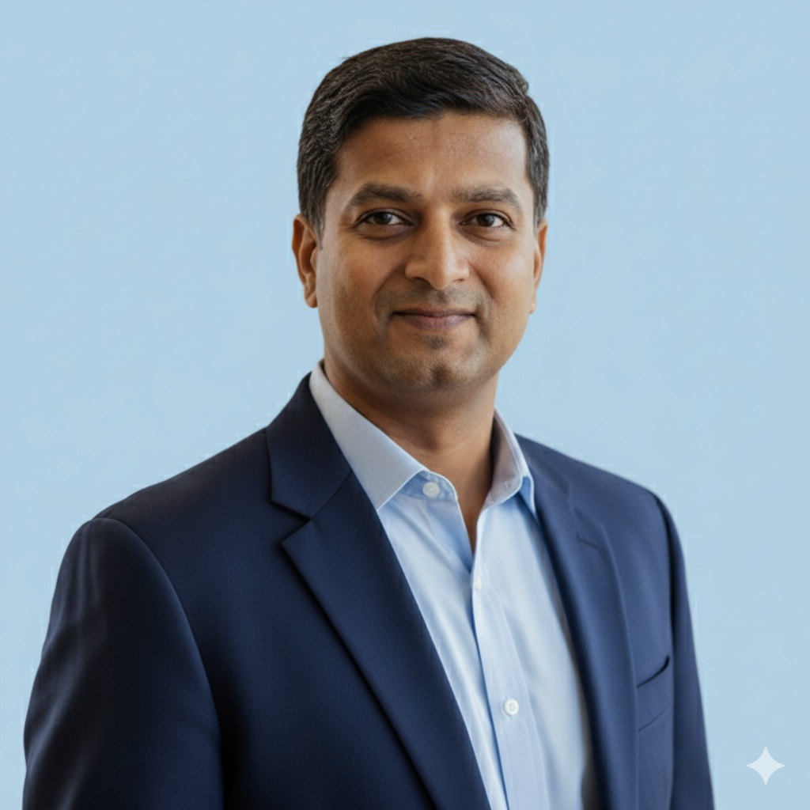

# Hi, I'm Yallappa Huchchannavar

**Lead AI Enterprise Data Engineer @ McAfee | AI Agent Development | Enterprise Data Platforms & Automation**

---

## About Me

With over 18 years of experience in data engineering and AI platform development, I design and deliver enterprise-scale data solutions and autonomous AI systems that transform business operations. I specialize in the fusion of AI, automation, and data engineering to enable enterprise decision-making at scale.

---

## Awards & Recognition

**Two-time AI Hackathon Winner:**

- **Best Innovation Hack (DET) 2025** - VizAI platform reducing Tableau dashboard creation from hours/days to under 2 minutes with $1.5B+ industry impact potential
- **Best Hack for Productivity 2024** - Automated AI hiring screener with real-time candidate scoring

---

## Technical Expertise

**AI & ML**: AgentForce, RAG, LLMOps, MCP Server Development, Einstein Vision & Language APIs, OpenAI & Anthropic APIs

**Data Engineering**: ETL, Data Warehousing, Snowflake, Apache Spark, Apache Airflow, Data Cloud, dbt

**Platforms**: Salesforce, Snowflake Cortex AI, Tableau, Informatica, Jenkins CI/CD

**Languages**: Python, PySpark, SQL, Apex, JavaScript

---

## Recent Impact

- Built autonomous agents for structured (Data Cloud + SOQL) and unstructured data, automating Apex generation, testing, and CI/CD
- Developed enterprise MCP servers enabling AI orchestration across Snowflake, GitHub, Google Drive, and Salesforce
- Implemented Snowflake Cortex AI for automated metadata enrichment satisfying enterprise audit requirements
- Optimized DAG dependency architecture saving **700+ hours annually**
- Reduced access request turnaround from days to hours (**70% efficiency gain**)
- Eliminated **70% of manual administrative overhead** through automation
- Presented at **Dreamforce** showcasing applied AI in enterprise contexts

---

## Featured Personal Projects

### Security & Analytics

| Project | Description |
|---------|-------------|
| [**cybersec-telemetry-analysis**](https://github.com/yvh1223/cybersec-telemetry-analysis) | Analyze cybersecurity telemetry data for threat detection and security insights |
| [**security-analyzer**](https://github.com/yvh1223/security-analyzer) | Security analysis tools and utilities |
| [**antivirus-market-intelligence**](https://github.com/yvh1223/antivirus-market-intelligence) | Market intelligence analysis for antivirus products |

### Education & Family Projects

| Project | Description |
|---------|-------------|
| [**vihaan-swim-tracker**](https://github.com/yvh1223/vihaan-swim-tracker) | Track my son's competitive swim times and progress toward USA Swimming time standards |
| [**vihaan-learning-platform**](https://github.com/yvh1223/vihaan-learning-platform) | Interactive learning platform for kids |
| [**5th-grade-science-curriculum**](https://github.com/yvh1223/5th-grade-science-curriculum) | Comprehensive 5th grade science curriculum and STAAR prep |

### Utilities & Tools

| Project | Description |
|---------|-------------|
| [**youtube-transcript-processor**](https://github.com/yvh1223/youtube-transcript-processor) | Process and analyze YouTube video transcripts |

---

## Certifications

- Salesforce AI Associate
- Salesforce Data Cloud
- Salesforce Extreme Productivity
- Python Quick Start

---

## Career Journey

| Period | Role | Company |
|--------|------|---------|
| 2025 - Present | Lead AI Enterprise Data Engineer | McAfee |
| 2024 - 2025 | Lead AI Engineer | Salesforce |
| 2023 - 2024 | Lead Data Engineer @ Tableau | Salesforce |
| 2021 - 2023 | Senior Member of Technical Staff | Salesforce |
| 2019 - 2021 | Data Engineer | Salesforce |
| 2015 - 2019 | Sr. Informatica/IDQ Consultant | Lincoln Financial |
| 2009 - 2015 | ETL Lead Developer | XL Catlin (via TCS) |
| 2007 - 2009 | ETL Developer | TCS for MetLife |

---

## Let's Connect

- [LinkedIn](https://www.linkedin.com/in/yallappa/)
- [GitHub](https://github.com/yvh1223)

---

*"Enable enterprise decision-making at scale through the fusion of AI, automation, and data engineering excellence."*
